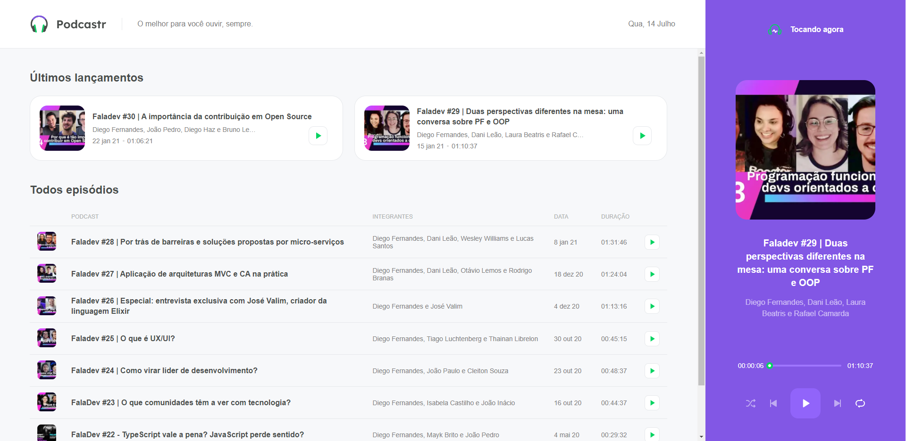

<h1  align="center" class="row justify-content-center" >
   
  podcastrnext 
</h1>

<div align="center">
      
    <a href="https://www.linkedin.com/in/whuanderson-de-sousa-porto-marinho-a07204216//" target="_blank" rel="Whuanderson">
      
    </a>
       
</div>
 
<div align="center">
  
</div>
  
 <p align="center">
  :rocket: Um site de podcastr criado na NLW com a @rocketseat
 </p>
  
<div align="center">
  <sub>O Projeto. Feito por:
    <a href="https://github.com/Whuanderson">Whuanderson Marinho</a>
  </sub>
</div>

# 💻 Tecnologias 

-   [ ] [Typescript](https://www.typescriptlang.org/docs/) 
-   [ ] [Javascript](https://www.javascript.com/)
-   [ ] [SCSS](https://devdocs.io/css/)
-   [ ] [HTML](https://devdocs.io/html/)

  # 📱  Instalando e executando o projeto
  
  *Clone o projeto e acesse a pasta*

```bash
$ git clone https://github.com/Whuanderson/podcastrnext
$ cd podcastrnext
```
*Siga os passos abaixo:*

```bash
# Instale as dependências
$ yarn install

# Execute em um terminal :)
$ yarn start

# Muito bem, o podcastrnext é iniciado! basta clicar na uri
ready - started server on 0.0.0.0:3000, url: http://localhost:3000

```
  # :closed_book: Licença

Lançado em 2021 :closed_book: Licença

Feito por [Whuanderson Marinho](https://github.com/Whuanderson) 🚀.
Esse projeto está sobre [MIT license](./LICENSE).
criado no NLW
Um site de podcastr criado na NLW com a @rocketseat e usando o discovery para aprender a colocar no Github.
